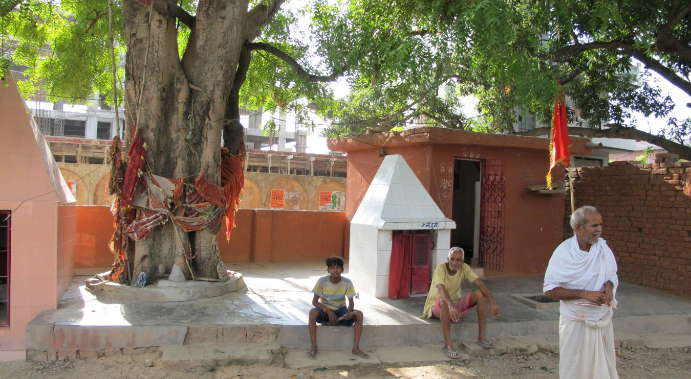
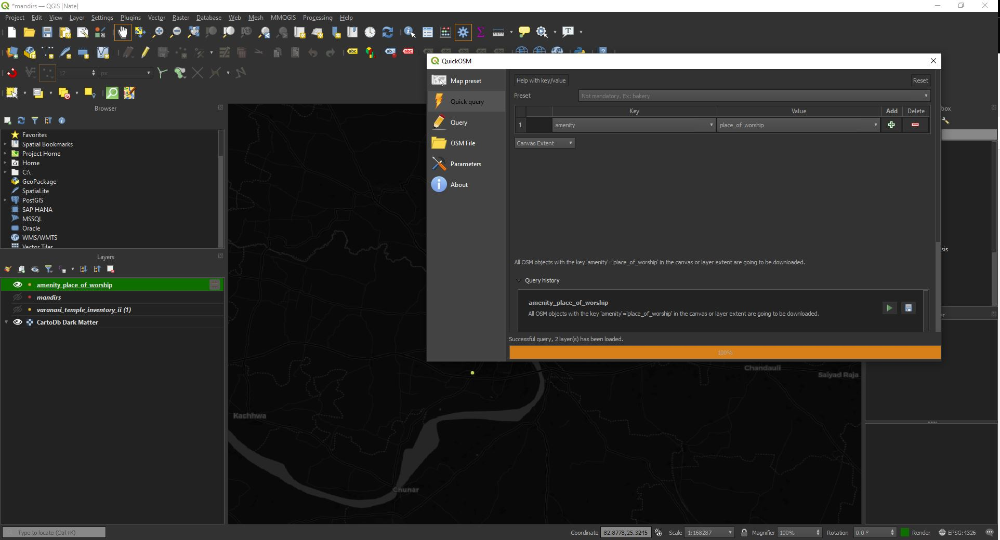

# Mapping the Mandir Points of Varanasi
This is an extension of the initial mandirs project started a few months ago. This project aims to map the actual point locations and associated information of mandirs found in Varanasi. A similar project was initiated a few months ago, but the resources and knowledge was unavailable then to conduct a webmap loading data by a clusterMarkerGroup method. 

This project aims to be an extension of the initial hex-map analysis that will provide more details about the mandir points that were collected while in Varanasi during the Spring and Summer of 2012. Below is an outline of this project including information about the nature of a 'mandir', their significance, and proper citation of the lead director of the project, Dr. Chris Haskett from Washington Lee University in Virginia.

 ## <center> Table of Contents </center>

1. Introduction
2. Goals 
3. Workflow
4. Webmapping
5. Citations

# <center> Chapter 1. Introduction: Results from a Geographic Survey of India's 'Tiny Temples' in the City of Varanasi, India 

### <center> By Nathaniel Deaton </center>

Scholarship associated with the function and study of sacred space in Hinduism has fallen short of providing a comprehensive view of the Hindu religious landscape. Traditionally, scholarship in the field lays heavy emphasis on grand, monolithic temple spaces as the dominant form of veneration among orthodox Hindus. Oftentimes, grand temples such as the [Kashi Vishwanath Temple](https://en.wikipedia.org/wiki/Kashi_Vishwanath_Temple) or the [Mrityunjay Mahadev Mandir](https://en.wikipedia.org/wiki/Mrityunjay_Mahadev_Mandir) served as examples of Hinduism's primary veneration hotspots. However, the most recurrent and numerous temples are typically no larger than a 1x1x1 meter shelter, often built into walls, trees, or as standalone structures that are found throughout the city. Traditional and academic circles have placed an inflated emphasis on monolithic temple spaces as the primary districts of veneration, while also neglecting temple spaces that are highly local, discreet, and much more frequent. Although many of these large temples *do* play an important role for many Hindus, smaller, 'tiny temples' also play an integral if not central role to many Hindus today.


*<center>Kashi Vishwanath Temple in Varanasi. These are often the temples associated with Hindu veneration practices although they are far less numerous than their smaller counterparts - Image taken by Nathaniel Deaton, 2012.</center>*


The diversity of thought, ritual, cosmological systems, and theology shouldn't surprise anyone that *temple building* and *sacred space* are also characteristically variable in Hinduism as well. Regardless, a primary function of the temple or *mandir*, is to house the deity. Within Hinduism, a wide corpus of major and minor traditions exist such as principal deities like [Ganesha](https://en.wikipedia.org/wiki/Ganesha) or [Shiva](https://en.wikipedia.org/wiki/Shiva). Minor traditions within Hinduism typically refer to small mandirs associated with street corners, trees, or holy places of interest for a local community. Additionally, even more minor traditions are considered *house churches* or those gods or goddesses venerated within a family or household. 



*<center> A temple complex between Varanasi and Sarnath - categorized as a tree, a tiny temple, and a medium temple - Image taken by Nathaniel Deaton, 2012.</center>*


In the summer of 2012, I had the privilege to join Dr. Chris Haskett on a field survey in Varanasi where our goal was to identify, record, and collect information pertaining to these 'tiny temples' that dot the urban and surrounding rural landscapes. Much of the aforementioned research has not provided a comprehensive view Hinduism's use of sacred space within these local contexts and for this reason, we sought to provide a more thorough examination of the role that 'tiny temples' played in cultural spheres. Chris' publication on these temples was published in the South Asia Multidisciplinary Academic Journal in 2018 and you can [read more about his work here](https://journals.openedition.org/samaj/4524).

# <center> Chapter 2. Goals
The goal of this project is to build upon the database of temples that were collected in 2012 and 2015 by creating an interactive map that allows viewers to learn more details about the location, deities, and sacred space these mandirs impart on the local community. As Dr. Haskett states, 
> *<center>"By observing where temples occur and the other features of landscape with which they frequently coincide, we can learn how temples instantiate the presence of deities at important junctures of shared space... our data also suggests a number of insights about the roles that tiny temples play in making Hinduism for the residents of Varanasi."</center>*

Over 2,850 individual mandirs were collected and recorded within the metropolitan area of Varanasi. Interviews and photographs were often collected in conjunction with a recorded GPS point for the mandir's location. Mandirs will be symbolized according to the deity that is venerated as well as popup information that describes them in more depth. 

By mapping out characteristics of mandirs we identified, our hope is that a more readily comprehensive geography of the city's public temples will emerge. Additionally, more analytical questions can be asked regarding frequency of temple localities that our GIS can play a role in answering.

## <center>Role of webmapping for this project </center>

More particularly, this project will create a web map that clusters the location points of the mandirs that were identified. Users will be able to click on individual points to read more information about what they symbolize and what information was collected about them. In doing so, the project seeks to aid in teaching about the multivariate nature of 'Hinduisms' in Indian culture by examining these 'tiny temples' in one of the country's holiest cities. 

# <center> Chapter 3. Workflow </center>
This chapter walks through the workflow for data processing via node and npm as well as OGR and Python in a JupyterLab environment. These tools will be used throughout this process in order to gain a better grip on using them for various purposes. First, we'll do a quick conversion of the excel file to .shp in QGIS. After this is completed, let's inspect the data in the terminal using OGR: 

```
$ ogrinfo mandirs.shp mandirs
```
The output tells us the following information: 


```
Layer name: mandirs
Metadata:
  DBF_DATE_LAST_UPDATE=2021-11-04
Geometry: Point
Feature Count: 2822
Extent: (82.961968, 25.235735) - (83.034169, 25.346171)
Layer SRS WKT:
GEOGCRS["WGS 84",
    DATUM["World Geodetic System 1984",
        ELLIPSOID["WGS 84",6378137,298.257223563,
            LENGTHUNIT["metre",1]]],
    PRIMEM["Greenwich",0,
        ANGLEUNIT["degree",0.0174532925199433]],
    CS[ellipsoidal,2],
        AXIS["latitude",north,
            ORDER[1],
            ANGLEUNIT["degree",0.0174532925199433]],
        AXIS["longitude",east,
            ORDER[2],
            ANGLEUNIT["degree",0.0174532925199433]],
    ID["EPSG",4326]]
Data axis to CRS axis mapping: 2,1
created_at: String (24.0)
updated_at: String (24.0)
created_by: String (254.0)
updated_by: String (254.0)
system_cre: String (24.0)
system_upd: String (24.0)
geometry: String (254.0)
what_kind_: String (254.0)
private_or: String (254.0)
what_kin_1: String (254.0)
activity: String (254.0)
notes: String (254.0)
photos: String (254.0)
photos_cap: String (254.0)
photos_url: String (254.0)
address_po: Integer64 (10.0)
deity: String (254.0)
deity_othe: String (254.0)
do_you_thi: String (254.0)
does_this_: String (254.0)
how_many_d: Integer64 (10.0)
what_if_an: String (254.0)
is_there_a: String (254.0)
```
Here, we can see that the Shapefile is already projected in WGS 84 EPSG 4326 and contains field with various datatypes. Let's continue by adding the locations of places of worship that are "largescale" building structures (as opposed to 'tiny temples'). 

First, using OSM, I've included the tag, <i> amenity = place_of_worship</i> and pulled down those point locations for the extent of the city of Varanasi:


<center> <i>Screenshot of OSM for data extraction for places of worship. Keeping only the point locations for this</i> </center>

While we're at it, let's take a couple of other things that will help users better understand where they are in the city. Let's try to pull down natural water bodies and neighborhood polygons. 

By using similar steps with OSM, we were able to pull down water bodies with the <i> natural = water </i> tag/value pair. 

For the neighborhood in Varanasi, I found a clearinghouse for geospatial data in India, particularly for Varanasi at <a href='https://mapcruzin.com/free-uttar-pradesh-country-city-place-gis-shapefiles.htm'> this website.</a> Now, let's use OGR2OGR and MapShaper to modify these files. 

For the water bodies, let's first remove some unnecessary field values leftover from OSM: 

```
$ ogr2ogr -select 
```

## Conversion 
Let's now convert this file to a GeoJson for use in a webmap. 

```
$ogr2ogr -f "GeoJSON" mandirs.json mandirs.shp
```

